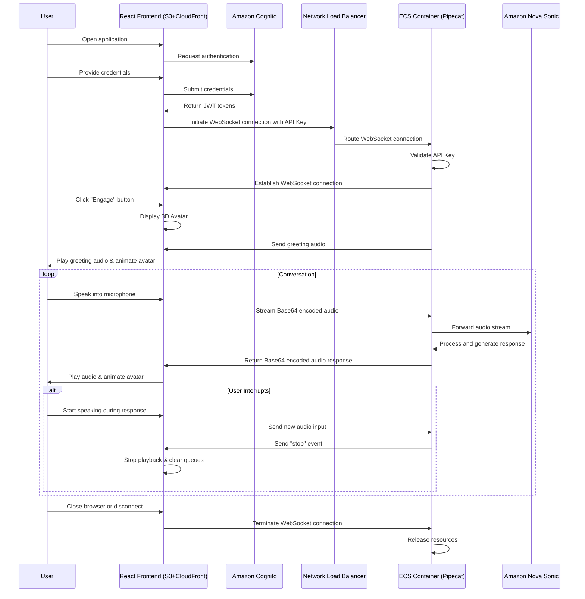

# Virtual Cloud Assistant - Event Flow Diagram

## Event Flow Description

### 1. User Authentication Flow
- User opens the React frontend application from CloudFront URL
- Frontend initiates authentication with Amazon Cognito
- User provides credentials (email/password)
- Cognito validates credentials and returns JWT tokens

### 2. WebSocket Connection Establishment
- Frontend uses JWT tokens to authenticate
- Frontend initiates WebSocket connection to NLB endpoint
- API Key is included in the WebSocket protocol for authorization
- NLB routes the connection to ECS container running Pipecat app
- Backend validates the API Key and establishes WebSocket connection

### 3. Voice Interaction Flow
- User clicks "Engage" button to start conversation
- 3D Avatar appears and greets the user
- User speaks into microphone
- Browser captures audio and sends Base64 encoded audio stream via WebSocket
- Pipecat backend receives the audio stream

### 4. Audio Processing Flow
- Pipecat uses custom FrameSerializer to handle Base64 encoded audio
- Audio is sent to Amazon Nova Sonic for processing
- Nova Sonic processes the audio input and generates response
- Response is sent back as Base64 encoded audio via WebSocket
- Frontend receives audio response and plays it through speakers
- 3D Avatar animates jaw movement synchronized with audio playback

### 5. Interruption Handling
- User can interrupt the assistant while it's speaking
- Backend detects interruption and sends "stop" event
- Frontend immediately stops audio playback and clears queues
- New conversation flow begins

### 6. Session Termination
- User can end the session by closing the browser or clicking disconnect
- WebSocket connection is terminated
- Resources are released
